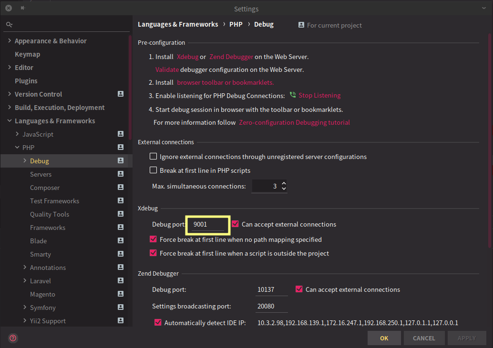
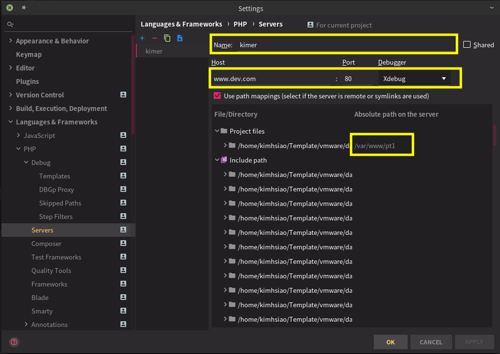

# How to use xdebug in [kdocker]

> *** Note: Only the default options are explained here. If it is broken after self-adjustment, please be responsible for it***

## surroundings

> Currently only used in the [IntelliJ-IDEA] ([PhpStorm]) family, other operations should be similar

### [IntelliJ-IDEA] Family

The environments that should be applicable include:

- [IntelliJ-IDEA]
- [PhpStorm]
- [WebStorm]
- ...

### [kdocker] Environment

That is [this project][kdocker]

## set up

### [This project][kdocker]

#### Steps

1. Set your own `.env` environment, which should be generated from the root of the `env-default`
1. Make sure your `PHP_FPM_INSTALL_XDEBUG` is set to `true`
    > `PHP_FPM_INSTALL_XDEBUG` is set to `true`, it will really open **xdebug** function
1. Adjust `WORKSPACE_PHP_XDEBUG_PORT` or `PHP_FPM_PHP_XDEBUG_PORT`
    > If you mainly use the web operation (php-fpm), then refer to the port number of `PHP_FPM_PHP_XDEBUG_PORT`. If it is a cli operation (workspace), refer to the `WORKSPACE_PHP_XDEBUG_PORT` port number. Of course, these two port numbers* Should not be the same or duplicated with other ports
1. Adjust the ***xdebug.ini*** file in the *php-fpm* and/or *workspace* folders as needed (optional)
    > Note, do not adjust the `xdebug.remote_port` parameter. Once changed, the related port number is wrong.

> *** Re-emphasize: This is mainly to explain the default options. If you can't use them after adjustment, please be responsible for ***

### [IntelliJ-IDEA]

#### Steps

1. Set the connection to the remote `Docker` environment, which is connected to the `Docker` environment of [this project][kdocker]
    > I will not go into details here. I can refer to the teaching instructions on other networks.
1. Set the port number of the remote docker's **xdebug**
    > This port number is mainly to see the port number set by the main development environment we used previously. Here we use the web operation, so mainly refer to the setting value of `PHP_FPM_PHP_XDEBUG_PORT`, here is ***9001** *
    >
    > 
1. Set the server environment for xdebug
    > - where *IDE Key* is set to `PHPSTORM` (this is the default)
    > - ×Host* is the address of the web server connected to your [kdocker], which can be ip, hostname or domain name, as long as you get it.
    > - *Port* is still the **xdebug port** you just set. Still set here ***9001***
    >
    > ![Set xdebug connection method] (../images/xdebug-2.png)
1. Set *xdebug* to correspond to the development environment
    > - *Name* The default setting value uses `kimer`, which is also the value specified by `serverName` in the setting value of `PHP_IDE_CONFIG` in the `.env` environment, here is `kimer` (general [Intellij-IDEA] The relevant settings can be given a name, but the settings here must be the same as the value specified by `PHP_IDE_CONFIG=serverName`, otherwise ***xdebug*** can't work normally. *** Very important, very important, very important ***)
    > - *Host* is the same as the one set in the previous step, which is the address of the web server connected to [kdocker], which can be ip, hostname or domain name.
    > - *Absolute path on the server* This refers to the absolute path in the remote server (that is, in [kdocker]), here we use the pt1 related settings, so we set it to `/var/www/pt1`
    >
    > 

[intellij-idea]: https://www.jetbrains.com/idea/ "Intellij-IDEA"
[PhpStorm]: https://www.jetbrains.com/phpstorm/ "PhpStorm"
[WebStorm]: https://www.jetbrains.com/webstorm/ "WebStorm"
[kdocker]: https://github.com/poyhsiao/kdocker "kdocker"